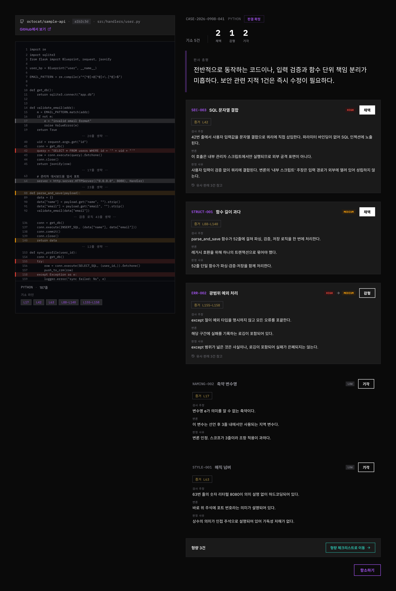
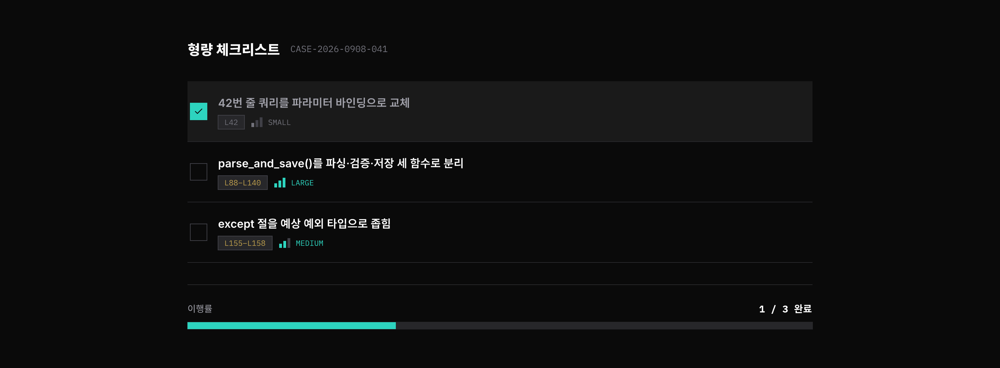
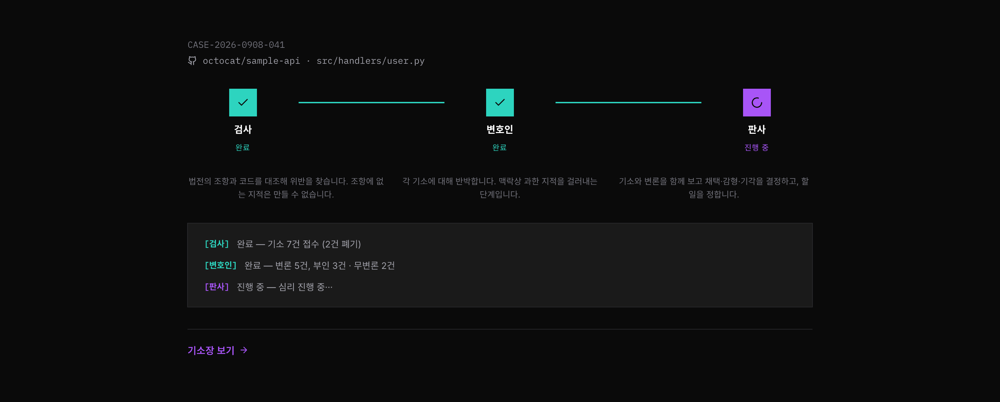
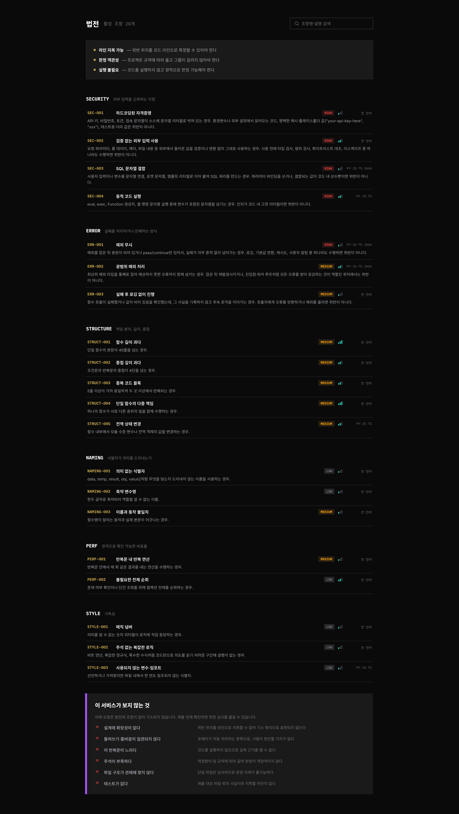

# Code Court

코드를 제출하면 AI 세 역할(검사·변호인·판사)이 재판을 열어, 걸러진 지적과 실행 가능한 리팩토링 할 일 목록을 내려주는 대립형 코드 리뷰 서비스입니다.

## 3단계 흐름

1. **검사** — 법전(사전 정의된 조항 목록)과 코드를 대조해 위반을 찾아 기소한다.
2. **변호인** — 각 기소에 대해 반박한다. 맥락상 과한 지적을 걸러내는 단계다.
3. **판사** — 기소와 변론을 함께 보고 채택·감형·기각을 결정하고, 할 일(형량)을 정한다.

## 핵심 설계

- **법전 제약** — 죄목은 코드가 임의로 지어내지 않고, 사전 정의된 조항 목록(`rules.yaml`)의 `rule_id`에서만 고를 수 있다.
- **증거 라인 검증** — 모든 기소는 코드 라인 범위를 증거로 지목해야 하며, 서버가 실제 라인 수와 대조해 검증한다. 범위를 벗어난 기소는 폐기된다.

## 문서

| 문서                                                       | 내용                                                                 |
| ---------------------------------------------------------- | -------------------------------------------------------------------- |
| [`docs/plans/plan.md`](docs/plans/plan.md)                 | 시스템 설계 — 상태머신, 스키마, 법전/판례 규칙, ERD, 비용 예산, 배포 |
| [`docs/plans/develop_plan.md`](docs/plans/develop_plan.md) | M1~M4 개발 마일스톤별 작업 목록                                      |
| [`docs/design.md`](docs/design.md)                         | UI 디자인 브리프 — 톤, 원칙, 토큰, 화면 목록                         |
| [`openapi.yaml`](openapi.yaml)                             | API 상세 스키마(OpenAPI 3.0)                                         |
| [`docs/api.md`](docs/api.md)                               | API 요약 — 엔드포인트 표, 사건 생명주기                              |
| [`rules.yaml`](rules.yaml)                                 | 법전(조항 목록) 원본                                                 |

## 화면 목업

`design.md` §5의 9개 화면 중 핵심 4개를 목업으로 제작했다. 나머지 5개(로그인, 코드 제출, 항소 입력, 재심 결과, 전과 기록)는 `design.md`에 구조와 문구가 정의되어 있으며 목업은 추후 제작한다. 제작한 4개가 제품의 핵심 흐름(진행 → 판결 → 형량)과 법전 열람을 덮으므로 설계 의도를 검증하는 데 충분하다.

| 판결문                               | 형량 체크리스트                                           |
| ------------------------------------ | --------------------------------------------------------- |
|  |  |

| 법정 진행                                         | 법전 열람                                   |
| ------------------------------------------------- | ------------------------------------------- |
|  |  |

## 기술 스택

- 클라이언트: Next.js
- 서버: FastAPI
- DB: PostgreSQL
- 큐: 별도 브로커 없이 PostgreSQL 폴링(스테이지 단위 워커) — 자세한 근거는 `docs/plans/plan.md` §3 참고

## 로컬 실행 방법

> 이 저장소는 현재 설계 문서·API 스펙·법전·목업 단계이며, 애플리케이션 코드는 아직 없습니다. 아래는 `docs/plans/develop_plan.md`의 M1 완료 후 예정된 실행 방법입니다.

```bash
# 서버
cd server
cp .env.example .env   # LLM API 키, DB 접속 정보, JWT 서명 키 채우기
pip install -r requirements.txt
alembic upgrade head
uvicorn app.main:app --reload

# 워커 (별도 프로세스)
python -m app.worker

# 클라이언트
cd client
npm install
npm run dev
```

## 배포 모드

배포 환경은 **fixture 모드**로 운영됩니다. LLM API 비용을 아직 확보하지 못한 상태이며, 이 모드에서도 상태머신·큐/워커 처리·서버 측 스키마/라인/법전 검증·판례 조회·항소/재심 흐름은 모두 실제로 동작합니다. 대체되는 것은 LLM 호출 지점 하나뿐이고, 실제 키가 확보되면 설정 변경만으로 전환됩니다(`docs/plans/plan.md` §12).

데모 계정: `TODO`
